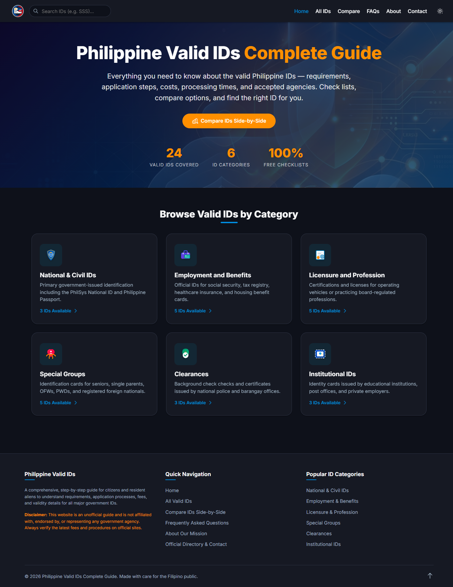
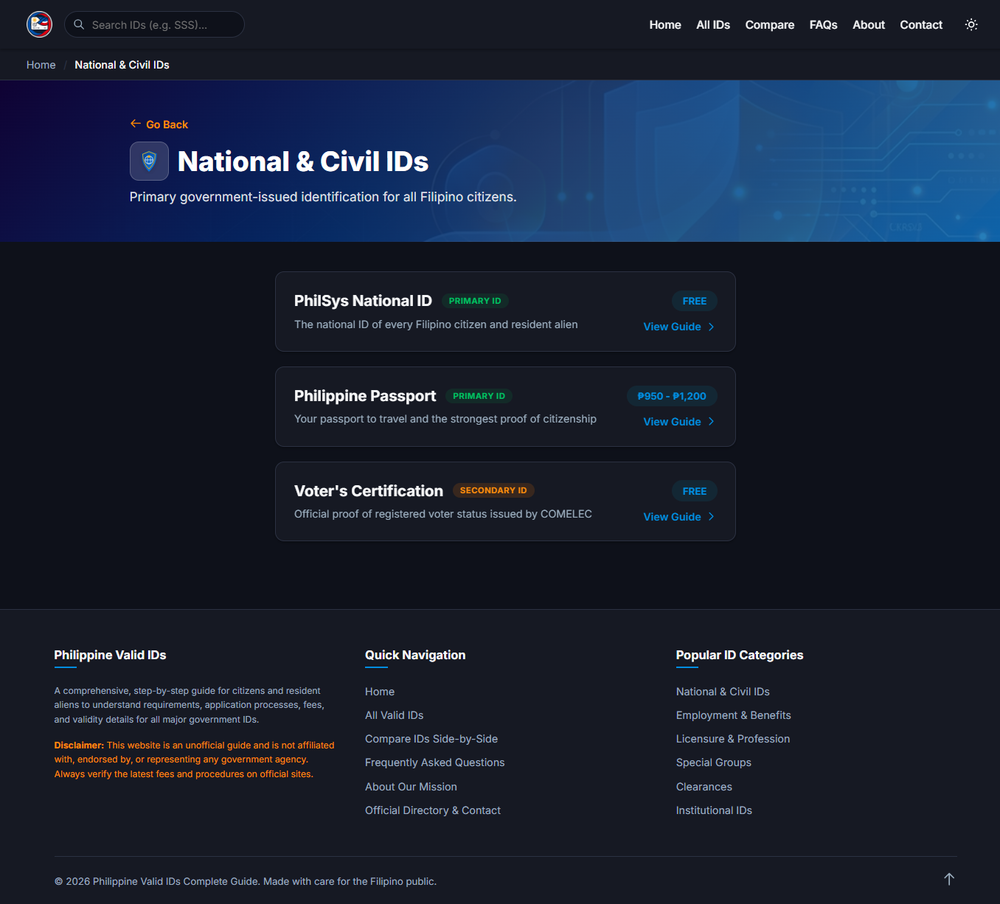
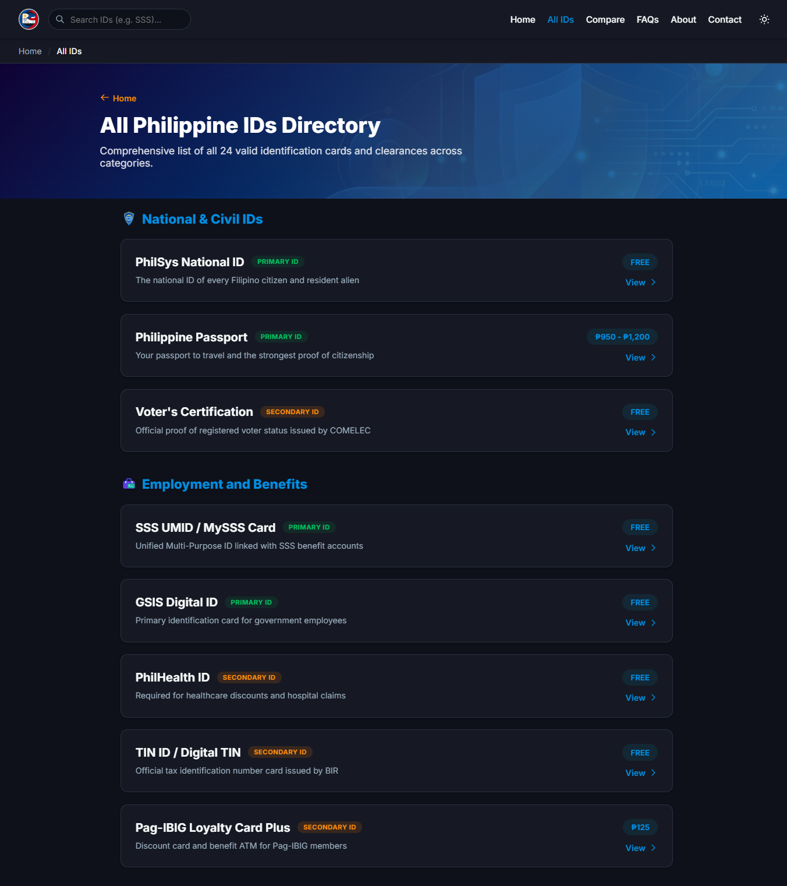
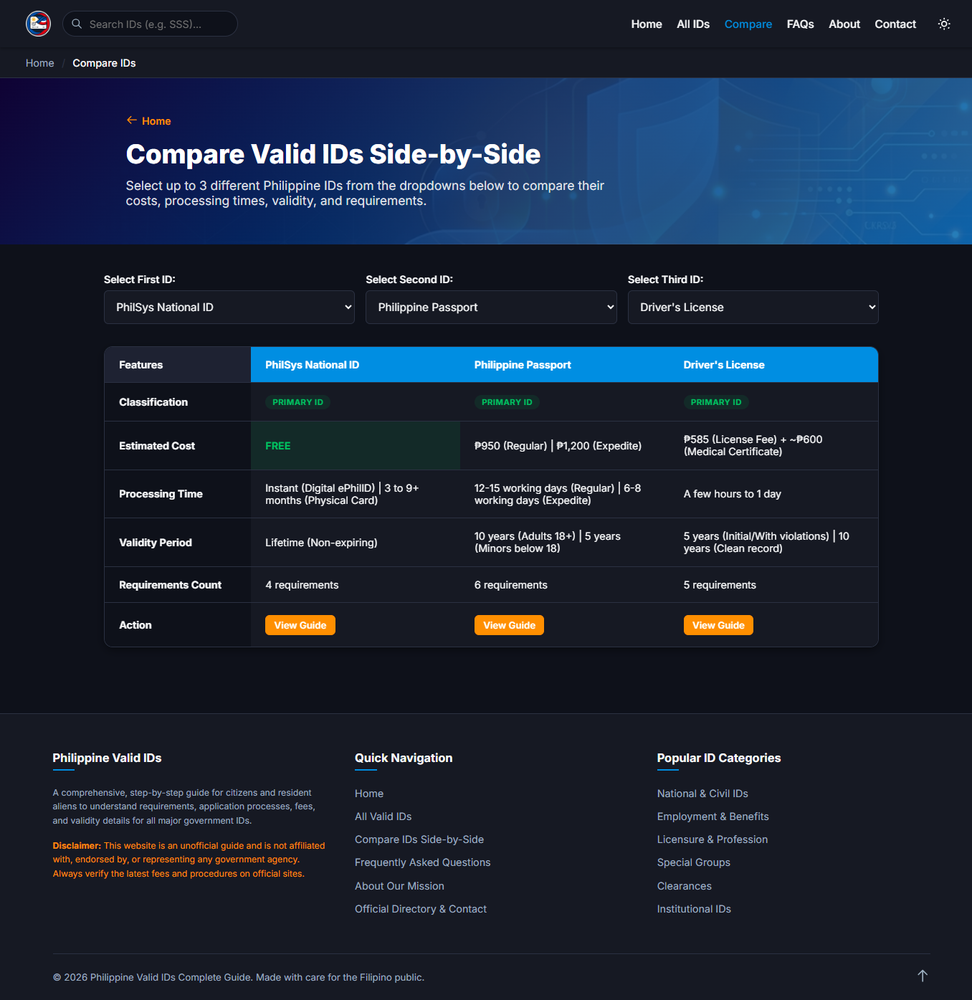
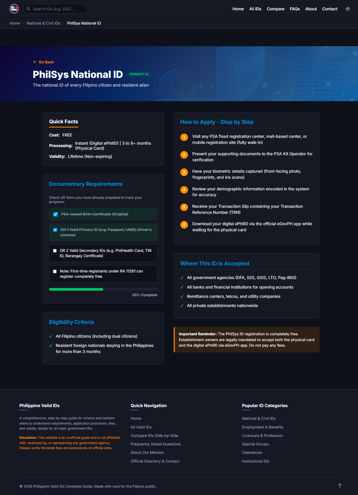

# Philippine Valid IDs Directory

**Live Application:** [https://zdarkin.github.io/government_id/](https://zdarkin.github.io/government_id/)

The Philippine Valid IDs Directory is a comprehensive, client-side web application designed to help citizens navigate the requirements, costs, and procedures for obtaining the 24 recognized valid government identification cards and clearances. Built with performance and accessibility in mind, it serves as a fast, fully responsive informational portal.

---

## 🚀 Key Features

*   **Dynamic Data Rendering:** Uses vanilla JavaScript to seamlessly inject static data into HTML templates, allowing for fast, client-side routing and content loading without page reloads for common layout elements.
*   **Zero Backend Required:** Operates entirely on the client side using structured JSON-like JavaScript arrays, meaning zero server latency, no database overhead, and instant data retrieval.
*   **Fully Responsive Design:** Crafted with modern CSS to ensure the user interface scales elegantly across mobile phones, tablets, and desktop displays.
*   **Modular Component Injection:** Dynamically loads common interface components (like navigation bars and footers) to keep the codebase DRY (Don't Repeat Yourself) and maintainable.
*   **XSS Protection:** Implements client-side HTML escaping to ensure dynamic content is safely sanitized before rendering in the DOM.

---

## 📁 Architecture & File Structure

The project follows a clean, modular structure separating content, presentation, and logic:

```text
government_id/
├── index.html                # Application entry point and homepage
├── assets/                   # Static assets
│   └── images/
│       └── icons/            # SVG icons for categories and IDs
├── components/               # Reusable UI fragments
│   ├── navbar.html           # Site navigation template
│   └── footer.html           # Site footer template
├── pages/                    # Individual page templates
│   ├── about.html            # About the project
│   ├── all-ids.html          # Directory listing of all IDs
│   ├── category.html         # Filtered view for specific ID categories
│   ├── compare.html          # Utility to compare ID requirements
│   ├── contact.html          # Contact and support information
│   └── detail.html           # Deep dive guide for specific IDs
├── scripts/                  # JavaScript logic and data models
│   ├── data.js               # Metadata mapping for categories and ID listings
│   ├── data-details.js       # Comprehensive schemas detailing requirements and steps
│   └── load-navbar.js        # Core logic for DOM manipulation, escaping, and routing
└── styles/                   # CSS stylesheets
    ├── base.css              # CSS variables, resets, and typography
    ├── components.css        # Reusable styles (buttons, cards, badges)
    └── pages.css             # Page-specific layout rules
```

---

## 🖼️ Screenshot Reference Gallery

Here are the visual captures of the application in various user interaction states:

### Homepage UI


### Category Listing View (National & Civil IDs)


### All IDs Directory List


### ID Comparison Tool


### ID Detail & Guide (Interactive Requirement Checklist)


---

## 🛠️ Setup & Installation

Since this application runs entirely client-side, running it locally is incredibly straightforward.

1.  **Clone the Repository:**
    ```bash
    git clone https://github.com/zdarkin/government_id.git
    cd government_id
    ```

2.  **Run a Local Server:**
    Because the application uses JavaScript `fetch()` API calls to inject the `navbar.html` and `footer.html` components, opening the files directly via `file://` protocol will result in CORS errors. You must serve the directory using a local web server. 
    
    If you have Python installed, simply run:
    ```bash
    python -m http.server 8000
    ```
    *(Alternatively, you can use the Live Server extension in VS Code, or Node's `npx serve`)*

3.  **View the Application:**
    Open your web browser and navigate to:
    ```text
    http://localhost:8000
    ```

---

## ⚙️ How It Works

The application operates without a traditional backend database. Instead, it leverages a **"Static Data Store"** pattern:

1.  **Data Storage (`scripts/data.js` & `scripts/data-details.js`):** All information regarding the IDs (names, costs, requirements, step-by-step procedures) is stored in structured JavaScript objects.
2.  **Routing via URL Parameters:** When a user navigates to a category or a specific ID guide (e.g., `detail.html?id=philsys`), the JavaScript reads the `?id=` or `?cat=` query parameters from the URL.
3.  **Dynamic DOM Construction:** 
    *   The script cross-references the URL parameter with the corresponding key in the JavaScript data objects.
    *   It extracts the relevant data, runs it through an `escapeHTML()` sanitization function for security, and constructs the necessary HTML strings.
    *   Finally, it securely injects this HTML into the pre-defined container `div`s on the page.
4.  **Component Injection:** A dedicated script (`load-navbar.js`) asynchronously fetches `components/navbar.html` and `components/footer.html` and mounts them, ensuring a consistent shell layout across all pages.

---

## 💻 Technologies Used

*   **HTML5:** Semantic markup and structure
*   **CSS3:** Custom properties (variables), Flexbox/Grid layouts, responsive media queries
*   **Vanilla JavaScript (ES6+):** Client-side logic, data management, dynamic DOM manipulation, and component injection
